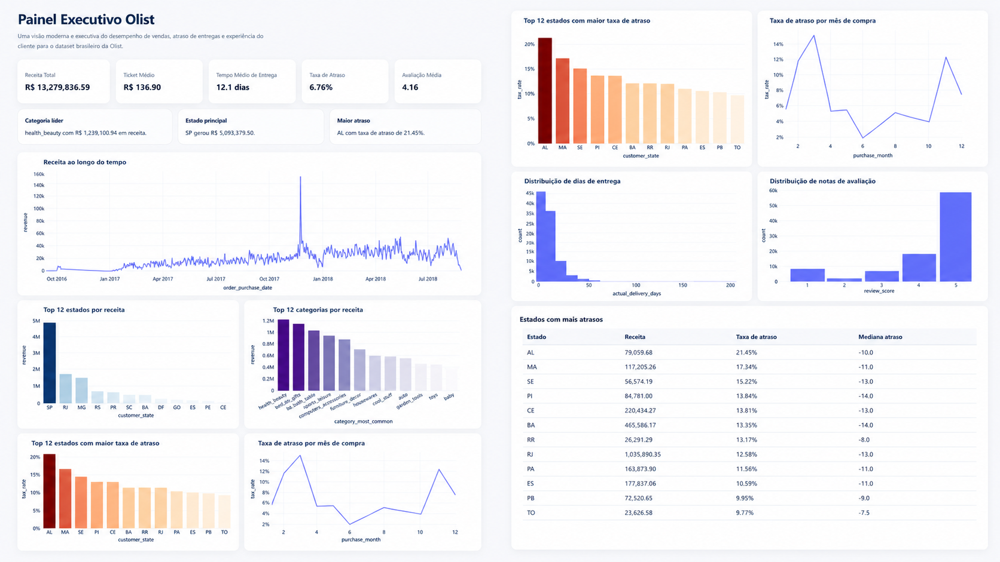

# 📊 Análise e Previsão de Atrasos no E-commerce Brasileiro

Projeto de dados utilizando o dataset da Olist para análise de performance logística e previsão de pedidos em atraso.

## O que é

Este repositório entrega um pipeline completo para:
- analisar a performance de vendas e logística
- identificar os estados e categorias mais afetados por atrasos
- prever quando um pedido tem risco de chegar atrasado
- gerar um dashboard executivo e um relatório com os principais indicadores

## 🎯 Problema

Atrasos em entregas impactam diretamente a satisfação do cliente e geram custo operacional.

Este projeto busca:
- identificar padrões de atraso
- entender fatores críticos que afetam a entrega
- prever pedidos com risco de atraso antes da entrega

## 📦 Dataset

Dados públicos de e-commerce da Olist.

Inclui:
- pedidos
- clientes
- produtos
- pagamentos
- avaliações

## ⚙️ Pipeline de Dados

1. Ingestão de dados
2. Limpeza e tratamento
3. Feature engineering
4. Análise exploratória
5. Modelagem preditiva
6. Avaliação e monitoramento

## 📊 Dashboard

Principais métricas:
- Receita total
- Ticket médio
- Taxa de atraso
- Tempo médio de entrega
- Avaliação média

O projeto gera um painel interativo em `dashboard.html`.

### Captura do Dashboard



## 🤖 Modelo Preditivo

Objetivo: prever atrasos em pedidos.

Algoritmos utilizados:
- Random Forest
- (pipeline preparado para testes com outros modelos)

Métrica principal:
- ROC AUC
- análise adicional com relatório de classificação

Resultado:
- modelo treinado para classificar risco de atraso em pedidos

## 💡 Insights

- estados com maior receita também podem apresentar maior taxa de atraso
- categorias mais vendidas exigem atenção especial na logística
- atrasos têm impacto direto na avaliação do cliente

## 🚀 Como executar

```bash
git clone <repo-url>
cd Project
python -m venv .venv
.venv\Scripts\activate
pip install -r requirements.txt
python main.py
```

## 🛠️ Tecnologias

- Python
- Pandas
- NumPy
- Scikit-learn
- Plotly

## 🔮 Próximos passos

- implantar o modelo em produção
- criar API com FastAPI
- adicionar monitoramento de drift
- organizar notebook de exploração e dashboards adicionais

## Se você fosse dono deste e-commerce

Com esses dados, eu priorizaria:
- reduzir os atrasos nos estados de maior receita
- otimizar logística para as categorias com maior taxa de falta de pontualidade
- montar alertas de retraining quando a taxa de atraso simulada subir mais de 10% em relação ao histórico
